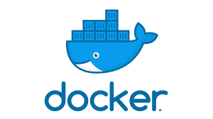
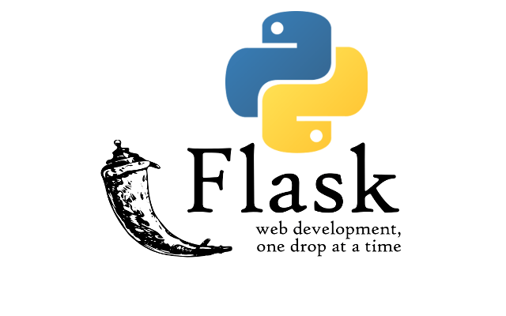

## Purpose
This hands-on training is designed to reinforce Docker concepts learned in the previous sessions by building a real-world multi-container application. Wel will implement a complete e-commerce product catalog system using Docker, Docker Compose, and best practices.





## Project Overview

### Technology Stack

- **Frontend**: React (simple UI for product management)
- **Backend**: Flask (RESTful API)
- **Database**: PostgreSQL (persistent data storage)
- **Cache**: Redis (performance optimization)
- **Orchestration**: Docker Compose

## Architecture

```                       AWS EC2-INSTANCE
┌─────────────────────────────────────────────────────────────┐
│                        Docker Bridge Network                │
│                                                             │
│  ┌──────────────┐      ┌──────────────┐                     │
│  │   Frontend   │      │   Backend    │                     │
│  │   (React)    │◄────►│   (Flask)    │                     │
│  │   Port 3000  │      │   Port 5000  │                     │
│  └──────────────┘      └───────┬──────┘                     │
│                                 │                           │
│                        ┌────────┴────────┐                  │
│                        │                 │                  │
│                 ┌──────▼──────┐   ┌─────▼──────┐            │
│                 │  PostgreSQL │   │   Redis    │            │
│                 │  (Database) │   │  (Cache)   │            │
│                 │  Port 5432  │   │  Port 6379 │            │
│                 └─────────────┘   └────────────┘            │
│                                                             │
└─────────────────────────────────────────────────────────────┘
```

### Service Details

1. **Frontend Service**
   - Technology: React
   - Purpose: User interface for product management
   - Exposed Port: 3000
   - Dependencies: Backend API

2. **Backend Service**
   - Technology: Flask (Python)
   - Purpose: RESTful API for CRUD operations
   - Exposed Port: 5000
   - Dependencies: PostgreSQL, Redis
   - Features:
     - Product CRUD operations
     - Redis caching for GET requests
     - Database connection pooling
     - Error handling

3. **PostgreSQL Service**
   - Purpose: Persistent data storage
   - Internal Port: 5432 (not exposed to host)
   - Features:
     - Data persistence with volumes
     - Initial data seeding
     - Connection from backend only

4. **Redis Service**
   - Purpose: Caching layer
   - Internal Port: 6379 (not exposed to host)
   - Features:
     - Cache product listings
     - TTL (Time To Live) configuration
     - Cache invalidation on updates

## API Endpoints for Backend Service

| Method | Endpoint | Description | Cache |
|--------|----------|-------------|-------|
| GET | /api/products | Get all products | Yes |
| GET | /api/products/:id | Get single product | Yes |
| POST | /api/products | Create new product | Invalidates cache |
| PUT | /api/products/:id | Update product | Invalidates cache |
| DELETE | /api/products/:id | Delete product | Invalidates cache |
| GET | /api/health | Health check | No |

## Project Structure

```
docker_office_hours_new/
├── README.md                           # This file
├── docker-compose.yml                  # Multi-container orchestration
├── .env.example                        # Environment variables template
├── .gitignore                          # Git ignore file
│
├── backend/
│   ├── Dockerfile                      # Backend image definition
│   ├── requirements.txt                # Python dependencies
│   ├── app/
│   │   ├── __init__.py                # Flask app initialization
│   │   ├── main.py                    # Application entry point
│   │   ├── models.py                  # Database models
│   │   ├── routes.py                  # API routes
│   │   └── cache.py                   # Redis cache utilities
│
├── frontend/
│   ├── Dockerfile                      # Frontend image definition
│   ├── package.json                    # Node.js dependencies
│   ├── public/
│   │   └── index.html                 # HTML template
│   └── src/
│       ├── App.js                     # Main React component
│       ├── index.js                   # React entry point
│       ├── ProductList.js             # Product listing component
│       └── ProductForm.js             # Add/Edit product form
│
└── database/
    └── init.sql                        # Database initialization script
```


**Security Group Rules:**
```
Type        Protocol    Port Range    Source         Description
SSH         TCP         22           0.0.0.0/0      SSH access
Custom TCP  TCP         3000         0.0.0.0/0      Frontend
Custom TCP  TCP         5000         0.0.0.0/0      Backend API
```


